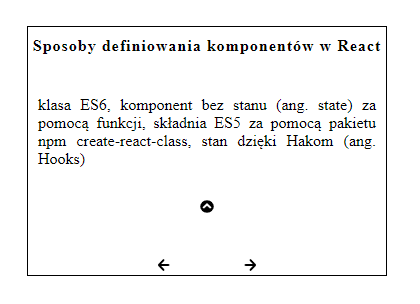

# Description

React learning cards.

# Code

```javascript
//example data
const questions = [
  {
    id: 1,
    question: "Sposoby definiowania komponentów w React",
    text: "klasa ES6, komponent bez stanu (ang. state) za pomocą funkcji, składnia ES5 za pomocą pakietu npm create-react-class,  stan dzięki Hakom (ang. Hooks)",
  },
});

//next question
  const nextQuestion = () => {
    setIndex((index) => {
      const newIndex = index + 1;
      if (expand === true) {
        setExpand(!expand);
      }
      return checkNumber(newIndex);
    });
  };

  //JSX
    return (
    <div className="container">
      <article className="card">
        <h4>{questions[index].question}</h4>
        <p className="answer">
          {expand
            ? questions[index].text
            : `${questions[index].text.substring(0, 0)}`}
        </p>
        <button onClick={() => setExpand(!expand)}>
          {expand ? <FaChevronCircleUp /> : <FaChevronCircleDown />}
        </button>
        <div className="navigation">
          <button onClick={prevQuestion}>
            <FaArrowLeft />
          </button>
          <button onClick={nextQuestion}>
            <FaArrowRight />
          </button>
        </div>
      </article>
    </div>
  );
```

## View



